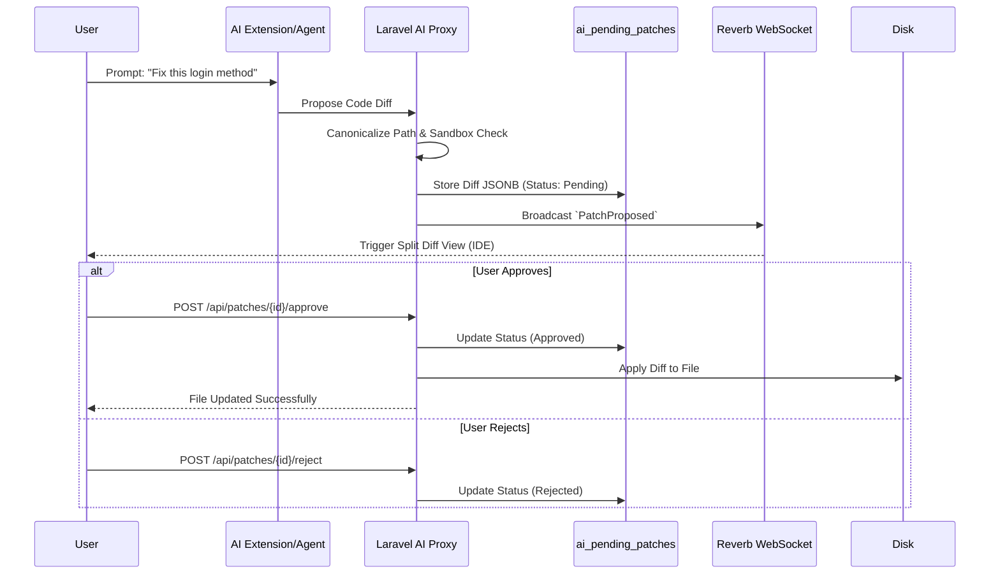

# AI Workflow & Security Directives

This document mandates how artificial intelligence interacts with the VisionLab codebase, enforcing strict human-in-the-loop (HITL) authorization protocols.

---

## Core Principle: Zero Direct Write Access (For Student/Product AI)
The in-product AI Agent operates within the codebase to assist, refactor, and build components. However, **the agent has zero autonomous write access** to critical files without explicit human authorization.

> [!CAUTION]
> **Builder AI Override:** This Zero-Write policy applies ONLY to the deployed product. The Builder AI (VisionForge) has full, aggressive autonomy to delete legacy UI components (such as floating HTML chat panels, redundant file explorers) and decouple upstream extensions to build an independent ecosystem.

### The Patch Approval Sequence (`ai_pending_patches`)

---

## 2. Server-Side Execution (Proxying)

To protect API Keys (OpenAI, Anthropic, Gemini) from being extracted by students via browser DevTools or workspace memory inspection, all AI communication routes through a Laravel Proxy.

- **SSE Streaming**: Responses are streamed via Server-Sent Events to provide real-time token rendering.
- **Rate Limiting**: Throttled based on user role and course quotas using Redis.

---

## 3. VisionGuard Anti-Cheat Forensics

Every interaction is tracked. When the AI proposes a patch and it is applied, VisionGuard explicitly tags that block of code.
- `keystroke_human`: Analyzed via typing speed intervals.
- `keystroke_ai`: Registered instantly when a patch is approved.
- **Rollback Snapshots**: Before the `AiSandbox` applies a patch, a micro-snapshot of the file is saved, enabling an instant `CTRL+Z` system architecture.
