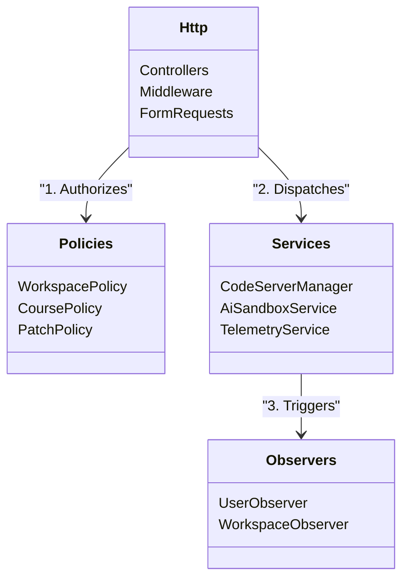

# System Architecture Deep Dive

VisionLab utilizes an advanced Domain-Driven Design (DDD) approach within the Laravel 11 framework to ensure absolute zero-trust execution.

---

## 1. Core Component Map

## 2. Strict Directory Enforcement

| Namespace | Responsibility | Security Constraint |
| :--- | :--- | :--- |
| `App\Http\Controllers` | Data mapping and request orchestration. | **NO BUSINESS LOGIC ALLOWED**. Must delegate to Services. |
| `App\Services` | Heavy lifting (Docker APIs, LLM streams). | Must not return HTTP responses, only DTOs or Models. |
| `App\Policies` | Zero-Trust Gates. | Invoked automatically via Middleware or explicit `$this->authorize()`. |
| `App\Jobs` | Asynchronous scaling operations. | Must be strictly idempotent (safe to run multiple times). |

## 3. The Docker Orchestration Layer

The system acts as an infrastructure controller. 
- **CodeServerManager**: Instead of static Docker Compose files, the system dynamically generates `docker run` commands using PHP's `Symfony\Component\Process`.
- **Path Canonicalization**: `realpath()` is applied to all container volume mappings to prevent directory traversal attacks by malicious students.

## 4. Frontend & Theming Architecture

The UI is built on a highly sophisticated styling system:
- **Core Engine**: Tailwind CSS + Vanilla JS (No React/Vue overhead for the main dashboard).
- **Aesthetic DNA**: Ultra-premium, Google-inspired fluid gradients (`bg-gradient-to-br from-indigo-500 via-purple-500 to-pink-500`) with glassmorphism overlays (`backdrop-blur-md bg-white/10`).
- **Geometry & Physics**: Everything must be "pilled" or highly rounded. Elements should appear to float. The Hero section must feature superb interactivity and 3D-type elements.
- **Workspace Color Scheme**: Strictly **Orange** (`#f97316`) accents to denote the active coding area, mentally separating the "Classroom" from the "Laboratory".
