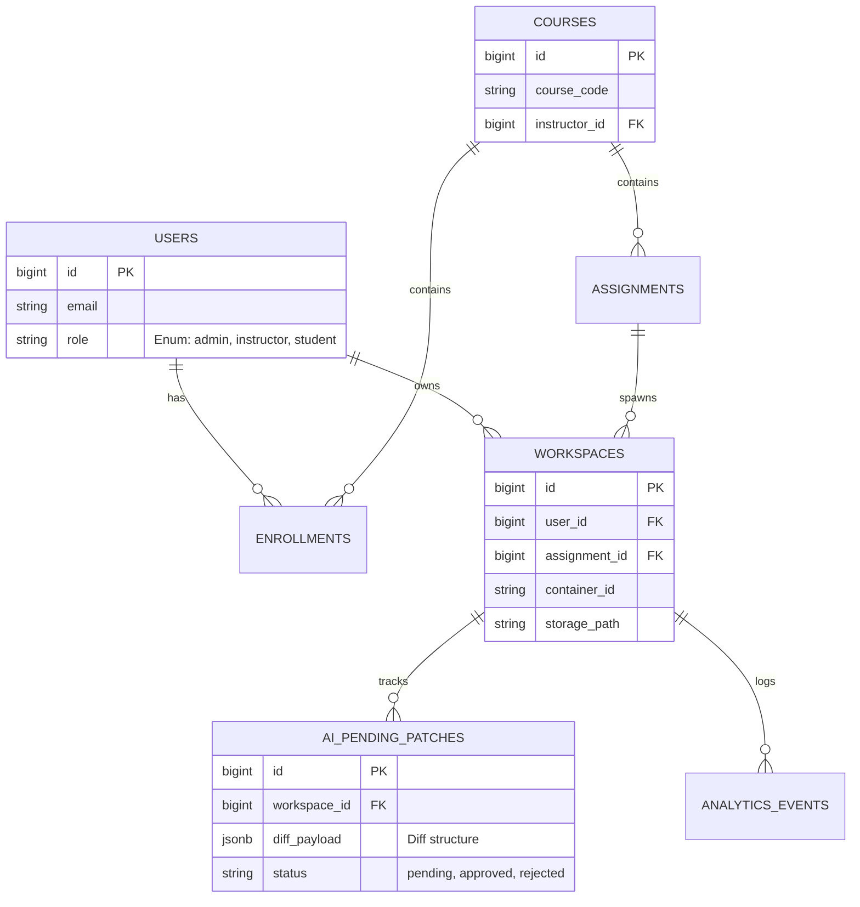

# Database Schema & Entity Relationships

VisionLab's database requires strict integrity constraints, foreign key cascading, and heavy use of `JSONB` for telemetry.

---

## 1. Entity-Relationship (ER) Diagram



## 2. Table Specifications & Laravel Casts

### `ai_pending_patches`
Critical table for the human-in-the-loop workflow.
- `diff_payload` must be stored as `JSONB` to allow the frontend diff viewer to quickly parse additions/deletions without massive string manipulation.
- **Model Casts**:
  ```php
  protected $casts = [
      'diff_payload' => 'array',
      'status' => PatchStatus::class, // Enum
  ];
  ```

### `analytics_events`
High-concurrency table for Analytics Dashboard metrics.
- Must not use foreign key constraints that restrict inserts, as this table will handle massive throughput.
- Uses partitioned indexing based on `created_at` for scalable read operations on instructor dashboards.

### `extensions`
Governs the `.vsix` plugins mounted into the Docker containers.
- Contains `checksum` (SHA-256) to ensure extension binaries have not been tampered with before injection into the IDE.
