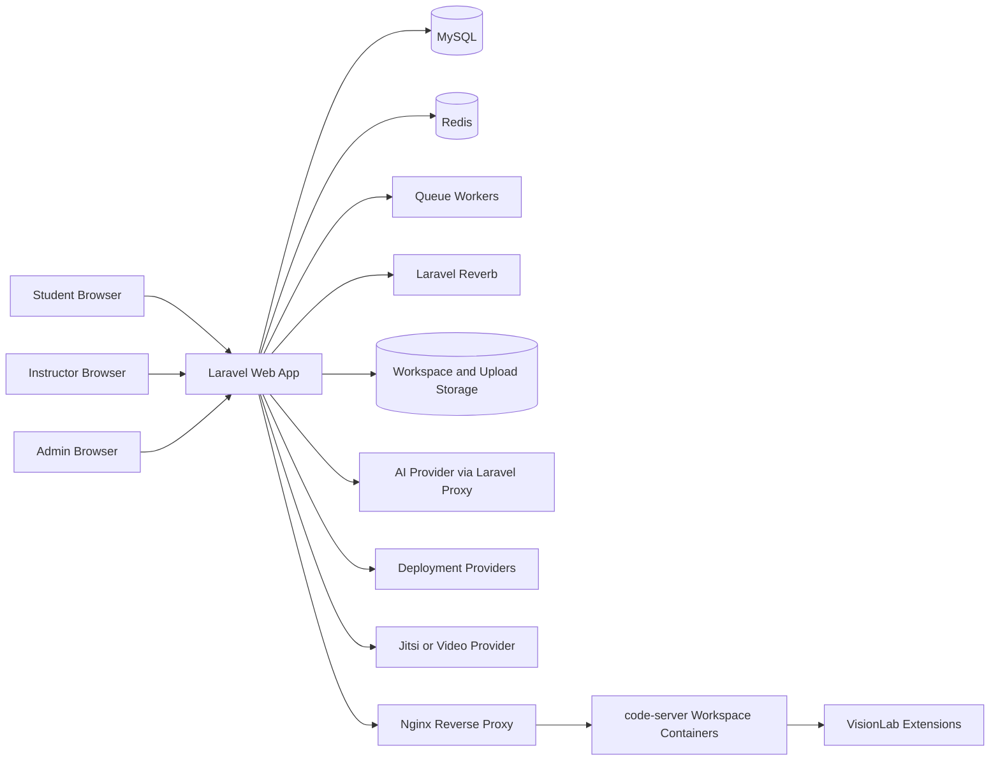
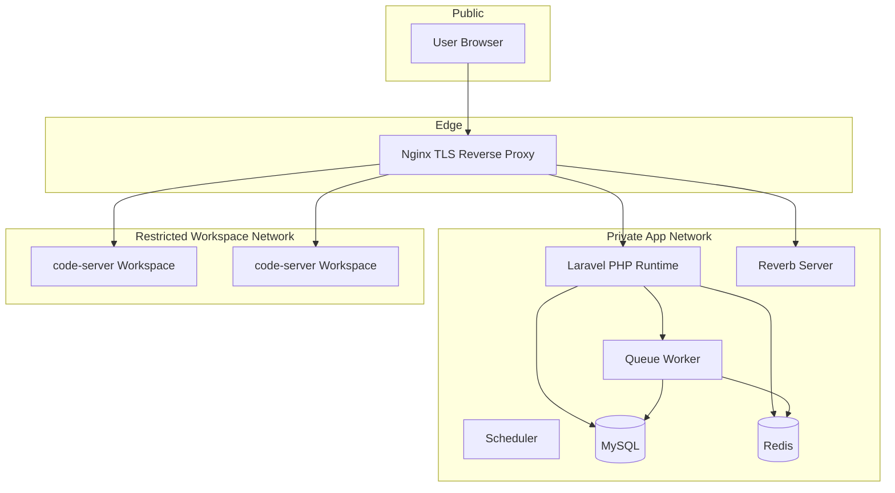
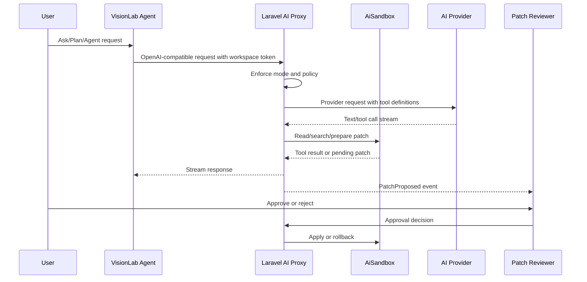

# VisionLab High-Level Design

## Document Control

| Field | Value |
|---|---|
| Product | VisionLab |
| Document | High-Level Design |
| Version | 1.0 |
| Source Prompt | `PROMPTS.xml` version `2026.06-competitive-ultimate-independent-agent-fork` |

## Architecture Basis

This HLD follows architecture-description thinking from ISO/IEC/IEEE 42010, which emphasizes architecture concerns, stakeholders, viewpoints, components, relationships, and principles.

Reference: [ISO/IEC/IEEE 42010](https://www.iso.org/standard/50508.html)

## Architecture Goals

- Keep all authority in Laravel policies and services.
- Isolate each code-server workspace.
- Keep AI provider secrets server-side.
- Make extension delivery reproducible.
- Treat service workers as progressive enhancement.
- Ensure production operations are observable and recoverable.

## Architecture Decisions to Record

| ADR Topic | Decision Needed | Trigger |
|---|---|---|
| Workspace isolation | container image, network boundary, storage root, quota policy, proxy route | before workspace lifecycle implementation |
| Extension artifact strategy | source-built artifacts, Open VSX/prebuilt utility policy, checksum storage, rollout method | before extension registry implementation |
| VisionLab Agent fork | source import process, legal review, rebuild process, release versioning, upstream review policy | before AI agent integration |
| AI provider abstraction | supported providers, secrets model, streaming behavior, token accounting, failure states | before AI service implementation |
| Collaboration protocol | event payloads, conflict handling, reconnect behavior, stale cleanup, channel authorization | before collaboration extension implementation |
| Deployment provider | provider priority, package exclusions, polling model, public exposure confirmation | before student deployment implementation |
| Production topology | Docker services, Nginx routes, TLS, WebSocket routing, backup/restore, observability | before production release |

## High-Level Context

## Logical Components

| Component | Responsibility |
|---|---|
| Laravel Web App | UI, auth, policies, classroom, admin, APIs |
| MySQL | Persistent product data |
| Redis | Cache, queues, sessions, Reverb scaling where configured |
| Queue Workers | Async jobs for notifications, deployment, extension sync, analytics |
| Scheduler | Due reminders, cleanup, health summaries |
| Reverb | Real-time events and presence |
| code-server Containers | Browser IDE workspaces |
| VisionLab Agent | Rebranded independent AI extension |
| VisionLab Collab Extension | Presence, cursor, chat, video bridge, patch listener |
| Patch Reviewer Extension | Multi-file patch review and approval |
| Nginx/Proxy | TLS, WebSocket proxy, code-server routing, security headers |
| AI Provider | Model execution through Laravel proxy |
| Video Provider | Jitsi session hosting |
| Deployment Provider | Student project deployment |

## Component Responsibility Matrix

| Component | Owns | Must Not Own |
|---|---|---|
| Controllers | request authorization, validation entry, response selection | business rules duplicated from services |
| Domain services | workspace lifecycle, AI policy, extension policy, deployment workflow | direct rendering or browser-only state |
| Policies/gates | authorization decisions and denial reasons | persistence side effects |
| Jobs | long-running external operations, retries, provider polling | unaudited security decisions |
| Events | real-time facts and state changes | secret values or unbounded payloads |
| Extensions | workspace UI integration and editor-side interaction | provider secrets, final authority, platform policy mutation |
| Admin UI | governance workflows and operational visibility | bypass routes or direct infrastructure access |

## Deployment View

## Data Architecture

Core domains:

- Identity: users, roles, account status.
- Classroom: courses, enrollments, announcements, assignments, submissions.
- Workspace: workspaces, collaborators, sessions, quotas.
- Extensions: extensions, extension builds, workspace extensions.
- AI: sessions, messages, actions, snapshots, pending patches.
- Collaboration: presence, chat messages, events.
- Video: video rooms.
- Analytics: analytics events, forensics, badges.
- Deployment: deployments and provider status.
- Notifications: push subscriptions, preferences.
- Operations: audit logs, health, release evidence.

## Authentication and Authorization

- Laravel authentication handles users and sessions.
- Role-based middleware separates admin, instructor, and student surfaces.
- Policies control domain actions.
- Reverb channels are authorized through workspace/course membership.
- Workspace file APIs re-check policies per request.
- Extension, AI, video, deployment, and admin operations all require policy checks.

## Workspace Architecture

Workspace lifecycle:

1. User opens assignment/workspace.
2. Laravel checks WorkspacePolicy.
3. CodeServerManager resolves quota, token, storage path, image, extension policy.
4. Container is created or reused.
5. Nginx routes authenticated traffic to the container.
6. File APIs enforce Laravel sandbox rules.
7. Lifecycle events are logged.

Security controls:

- No public unauthenticated workspace.
- Workspace-scoped token.
- Restricted container resources.
- Controlled writable mounts.
- No Docker socket exposure.
- Path canonicalization for every file operation.

## Extension Architecture

Extension categories:

- Required sensitive: VisionLab Agent, VisionLab Collab, Patch Reviewer, audit tooling.
- Approved utility: formatters, language tools, Git tools, markdown tools.
- Optional policy-controlled: instructor/admin approved tools.

VisionLab Agent lifecycle:

1. One-time compliant source import.
2. VisionLab-controlled fork.
3. Full source audit and rebrand.
4. Clean source rebuild.
5. Artifact checksum and registry entry.
6. code-server install smoke test.
7. VisionLab versioned release.
8. No automatic upstream production dependency.

## AI Architecture

AI security:

- Provider secrets stay server-side.
- Tool calls are server-authorized.
- Untrusted content is never policy authority.
- File mutation requires pending patch and human approval.
- Snapshots and rollback exist.

## Collaboration Architecture

Collaboration uses:

- Laravel Reverb presence channels.
- Workspace-scoped membership authorization.
- TypeScript extension modules.
- Heartbeat and stale session cleanup.
- Event payload validation and rate limits.

Events:

- user joined/left.
- cursor moved.
- selection changed.
- document changed.
- chat sent.
- patch proposed/status changed.
- video started/ended.
- deployment completed/failed.
- system warning.

## PWA Architecture

PWA design:

- Manifest and icons.
- Service worker for static assets and offline fallback.
- Sensitive APIs network-only.
- Workspace/IDE network-only.
- Push subscriptions tied to authenticated users.
- Notification URLs validated.

The IDE is explicitly online-only.

## Security Architecture

Security controls:

- ASVS matrix.
- Role policies.
- CSRF and session protection.
- Rate limits.
- CSP/HSTS/security headers.
- Upload validation.
- Workspace path sandboxing.
- AI tool sandboxing.
- Extension artifact verification.
- Container hardening.
- Audit logs.

## Quality Attribute Architecture

| Quality Attribute | Architectural Support |
|---|---|
| Availability | health endpoints, queue workers, scheduler checks, provider failure states, restartable workspace lifecycle |
| Performance | indexed relational schema, pagination, query review, async external operations, cache use where safe |
| Security | policy-first authorization, sandboxed file operations, AI tool restrictions, extension checksums, deployment exclusions |
| Privacy | role-restricted analytics, limited audit metadata, controlled visibility for submissions and AI records |
| Accessibility | reusable Blade components, semantic layout, keyboard-ready controls, visible focus states, responsive constraints |
| Observability | audit logs, correlation identifiers, job logs, health checks, deployment status, release evidence |
| Maintainability | service boundaries, provider abstractions, event contracts, jobs, policies, ADRs, RTM links |
| Recoverability | backups, restore rehearsal, snapshots, rollback workflow, workspace cleanup, deployment rollback notes |

## Data Retention and Privacy View

| Data Class | Examples | Retention Direction | Access Direction |
|---|---|---|---|
| Identity | users, roles, account status | retain while account is active and according to institutional policy | user, admin, authorized staff |
| Classroom | courses, enrollments, assignments, submissions, grades | retain according to academic retention policy | student owner, instructor, admin |
| Workspace | files, snapshots, container metadata, deployment package records | retain only as needed for coursework, grading, recovery, and audits | owner, collaborators, instructor/admin according to policy |
| AI records | sessions, messages, tool attempts, pending patches, snapshots | retain for transparency and audit with configurable cleanup policy | workspace owner, course staff, admin where authorized |
| Analytics | activity events, VisionGuard aggregates, badges, streaks | retain for learning analytics with privacy boundaries | role-restricted dashboards |
| Operations | audit logs, health reports, job logs, release evidence | retain for compliance, security review, and incident response | administrators and authorized operators |

## Observability Architecture

Signals:

- Health endpoint.
- Structured logs.
- Failed jobs.
- Workspace lifecycle events.
- AI actions.
- Extension sync jobs.
- Deployment jobs.
- Push failures.
- Provider errors.
- Disk and quota warnings.

## Architecture Risks

| Risk | Mitigation |
|---|---|
| Container breakout | restricted runtime, no Docker socket, limited mounts |
| AI prompt injection | untrusted content separation, tool controls, approvals |
| Extension supply-chain risk | source builds, checksums, registry |
| Over-cached sensitive content | network-only API and IDE routes |
| Provider outages | async jobs, retries, visible failure states |
