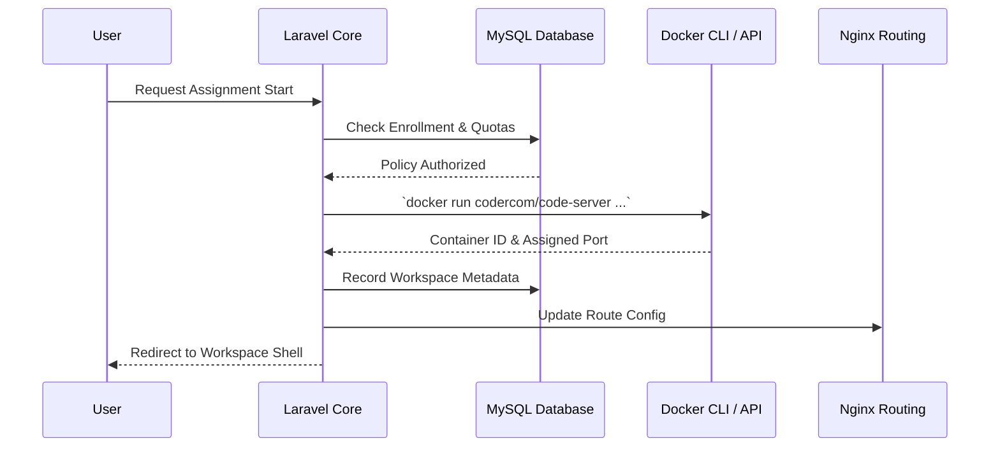
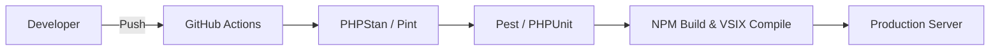

# VisionLab Overall Project Workflow

This document provides a highly detailed, end-to-end operational and development workflow for the VisionLab ecosystem. It is the definitive guide for understanding how data flows between the native Windows host, XAMPP, and Dockerized code-server containers.

---

## 1. Hybrid Infrastructure Architecture

VisionLab utilizes a strict hybrid environment for local development:
- **Host System**: Windows 11 running native services via XAMPP (Apache, MySQL) and CLI tools (`php`, `composer`, `npm`).
- **Container Engine**: Docker Desktop (WSL2 backend) is strictly isolated to orchestrating ephemeral `code-server` workspaces.

### Request Routing Flow
```mermaid
flowchart TD
    Client[Browser/Client] --> Nginx[Nginx / Apache Reverse Proxy]
    Nginx --> |API / Web / Auth| Laravel[Laravel 11 App on Host]
    Nginx --> |WebSocket| Reverb[Laravel Reverb on Port 8080]
    Nginx --> |Subdomain Routing| Docker[Docker Network]
    
    subgraph Host Network (Windows/XAMPP)
        Laravel <--> MySQL[(MySQL 8.0+)]
        Laravel <--> Redis[(Redis Cache/Queue)]
        Laravel <--> Queue[Queue Workers]
    end
    
    subgraph Docker Network
        Docker --> Container1[code-server: Workspace 1]
        Docker --> Container2[code-server: Workspace 2]
    end
```

---

## 2. Dynamic Workspace Lifecycle (The "Lab" Flow)

The core feature of VisionLab is the ability to provision isolated IDE workspaces for students. This process is highly regulated by zero-trust policies.

### Sequence: Container Provisioning


### Key Mechanisms:
- **Immutable Mounts**: VS Code extensions are mounted as read-only.
- **Port Mapping**: Docker binds dynamic ephemeral ports which Laravel tracks and reverse-proxies.
- **Cleanup**: Inactive workspaces are paused or archived asynchronously via Laravel Scheduler.

---

## 3. Real-Time Collaboration & Telemetry

VisionLab replaces traditional IDE sharing with a custom Laravel Reverb and TS-based VS Code extension ecosystem.

- **Presence Sync**: Determines who is active in the workspace.
- **Delta Document Sync**: Code changes are handled via CRDT or operational transformation to prevent merge conflicts.
- **Analytics Dashboard**: High-frequency telemetry pushes activity logs vs. AI paste events into a `JSONB` column to enforce academic integrity.

---

## 4. Development & CI/CD Pipeline

For engineers contributing to VisionLab, the workflow strictly forbids ad-hoc changes.

### Daily Development Routine:
1. **Pull & Sync**: `git pull origin main` && `composer install` && `npm install`.
2. **Database Reset**: `php artisan migrate:fresh --seed` (Uses structured factories, NO production data).
3. **Queue Activation**: Run `php artisan queue:work` to handle AI proxies and container commands.
4. **Compile UI**: `npm run dev` for Vite HMR.

### CI/CD Deployment Flow

